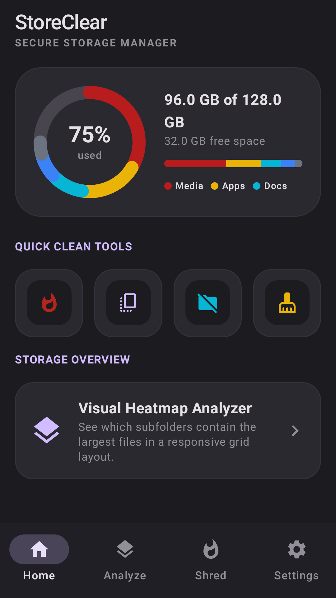
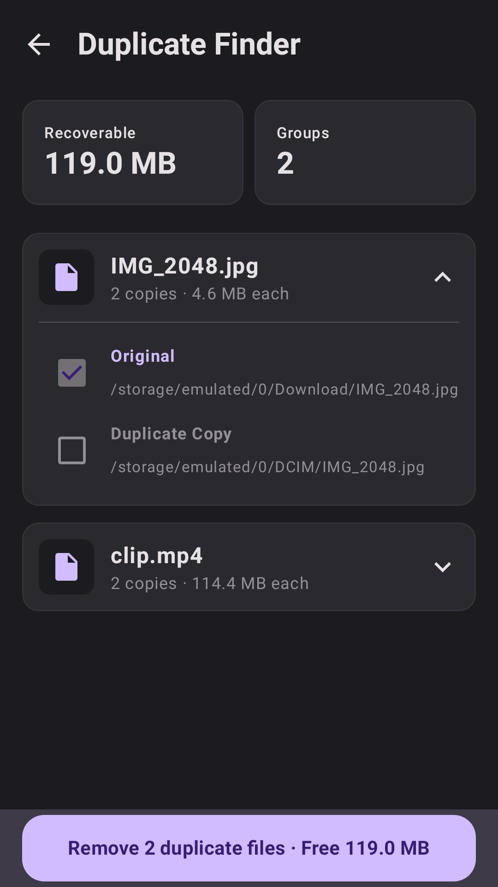
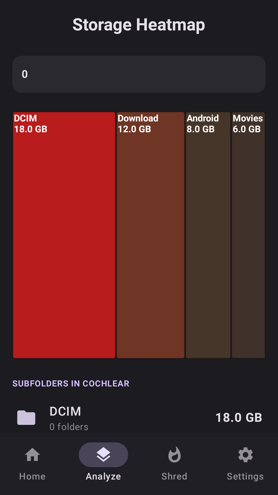
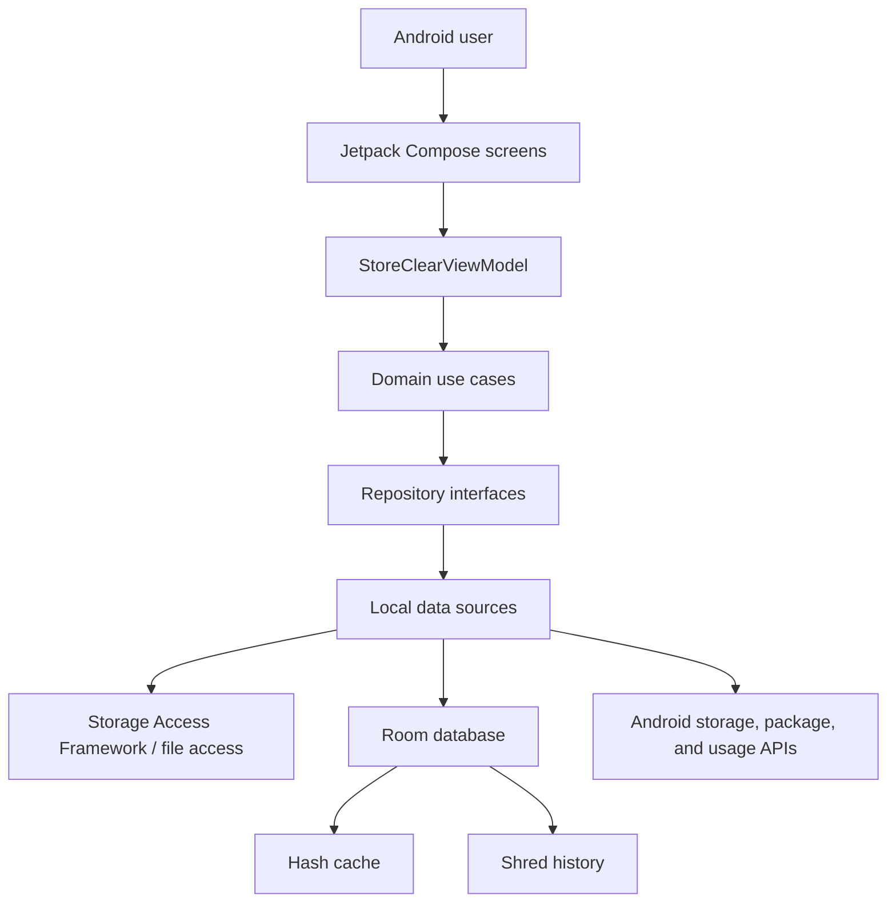

# StoreClear Android App


StoreClear is a privacy-first Android storage manager for finding hidden space, removing duplicate files, visualizing
large directories, and securely shredding sensitive files. It runs storage analysis locally on the device and is designed
for users who want practical cleanup tools without accounts, analytics, or file uploads.

The repository does not currently include CI, coverage publishing, or a `LICENSE` file. Update the badges after those are
configured.

<table>
  <tr>
    <td></td>
    <td></td>
    <td></td>
  </tr>
</table>

## Project Overview

StoreClear helps Android users understand where storage space went and remove clutter safely. It combines a storage
dashboard, duplicate detection, a treemap-style heatmap, empty-folder cleanup, cache review, and configurable multi-pass
file shredding. The Play Store listing copy describes the app as "Find hidden space. Leave no trace."

There is no hosted demo for the Android app in this repository.

## Key Features

- 📊 Storage dashboard shows total, used, and category-level storage summaries.
- 🔍 Duplicate finder buckets files by size, hashes candidates, and preselects removable copies.
- 🗺️ Directory heatmap visualizes large folders with drill-down navigation.
- 🧹 Empty-folder cleaner finds leftover directories and deletes selected items.
- 🧼 Cache cleaner reviews app/cache remnants from granted storage and usage access.
- 🛡️ Secure shredder overwrites selected files with configurable pass counts before deletion.
- ⚙️ Settings control hash algorithm, shred intensity, scan depth, system-folder exclusions, and theme.
- 🏪 Roborazzi tests generate Play Store screenshots, app icon, and feature graphic assets.

## Architecture Overview



### Components

`presentation` contains Compose screens, reusable dashboard/heatmap components, and `StoreClearViewModel` state flows.
`domain` defines storage models, repository contracts, and use cases such as duplicate scanning, heatmap building, and
secure shredding. `data` implements repositories using local data sources, Android storage APIs, and Room persistence.
`util` handles storage-root normalization and Android permission helpers.

### Data Flow

The app requests storage access, stores the chosen root locally, then uses domain use cases from the view model. Duplicate
scans walk the file tree, bucket files by size, compute MD5 or SHA-256 hashes, cache hash results in Room, and return
grouped duplicates to the UI. Shred jobs stream progress from the overwrite data source and persist completion history.

### Design Patterns

The code follows a lightweight clean-architecture structure with Compose state hoisted through `StateFlow`, repository
interfaces in the domain layer, concrete data-source implementations in the data layer, and dependency wiring in
`AppContainer`.

## Tech Stack & Libraries

| Layer | Technology | Version | Purpose |
|---|---:|---:|---|
| Android build | Android Gradle Plugin | 9.1.1 | Android application build and packaging |
| Language | Kotlin | 2.2.10 | App implementation and Compose compiler plugin |
| UI | Jetpack Compose BOM | 2024.09.00 | Declarative Android UI |
| UI | Material 3 | BOM-managed | App components and theme |
| Navigation | Navigation Compose | 2.8.9 | In-app navigation |
| Persistence | Room | 2.7.0 | Hash cache and shred-history database |
| Images | Coil Compose | 2.7.0 | Async image rendering |
| Permissions | Accompanist Permissions | 0.37.3 | Runtime permission helpers |
| Security | AndroidX Security Crypto | 1.1.0-alpha06 | Encrypted preference storage fallback path |
| Async | Kotlinx Coroutines | 1.10.2 | Background scans and streaming progress |
| Networking library | Retrofit / OkHttp / Moshi | 2.12.0 / 4.10.0 / 1.15.2 | Present as dependencies; no network API is wired in the inspected app code |
| Screenshots | Roborazzi | 1.59.0 | Play Store screenshots and graphics |
| Tests | JUnit / Robolectric | 4.13.2 / 4.16.1 | Unit and Android-resource tests |

## Prerequisites

| Requirement | Version / Notes |
|---|---|
| OS | macOS, Linux, or Windows with Android Studio support |
| Android Studio | Recommended for emulator/device runs |
| JDK | Java 11 compatibility is configured; use the JDK bundled with current Android Studio if possible |
| Android SDK | Compile SDK 36.1, min SDK 26, target SDK 36 |
| Gradle | Use the checked-in `./gradlew` wrapper |

| Variable | Required | Default | Description |
|---|---|---|---|
| `GEMINI_API_KEY` | No for inspected local storage features | `MY_GEMINI_API_KEY` in `.env.example` | Configured by the secrets plugin; Firebase/Gemini dependencies are currently commented or unused in inspected code |
| `KEYSTORE_PATH` | Release signing only | `my-upload-key.jks` or `key.properties` | Path to release keystore |
| `STORE_PASSWORD` | Release signing only | Not configured | Release keystore password |
| `KEY_ALIAS` | Release signing only | `upload` | Release key alias |
| `KEY_PASSWORD` | Release signing only | Not configured | Release key password |

## Installation & Setup

1. Clone the repository:

```bash
git clone https://github.com/michaelsam94/StoreClear.git
cd StoreClear/StoreClear
```

2. Create local environment settings:

```bash
cp .env.example .env
```

3. Build a debug APK:

```bash
./gradlew assembleDebug
```

4. Install on a connected device or emulator:

```bash
./gradlew installDebug
```

5. Launch the app and grant storage permissions when prompted. On modern Android versions, StoreClear directs the user to
   All files access settings for full-device storage management.

Database setup is automatic. Room creates the local app database on first run.

## Configuration

Configuration lives in `app/build.gradle.kts`, `.env`, `.env.example`, and optional signing files such as
`key.properties`.

Runtime settings are controlled inside the app and persisted locally:

| Setting | Options | Restart Required |
|---|---|---|
| Hash algorithm | `SHA256`, `MD5` | No |
| Shred intensity | `QUICK`, `STANDARD`, `SECURE` | No |
| Scan depth | Integer depth, default `4` | No |
| Exclude system folders | Boolean, default `true` | No |
| Dark theme | Boolean, default `true` | App recomposition handles changes |

## Usage / Quick Start

### Build and Run

```bash
./gradlew assembleDebug
./gradlew installDebug
```

Open StoreClear on the device, grant media/storage access, then enable All files access if Android prompts for it.

### Run Tests

```bash
./gradlew testDebugUnitTest
```

### Generate Play Store Assets

```bash
./gradlew generatePlayStoreAssets
```

Generated assets are written to `play-store/`, including phone screenshots, tablet screenshots, a 512px icon, and a
feature graphic.

## API Reference

Not applicable. StoreClear is a local Android application and the inspected code does not expose an HTTP API, public SDK,
CLI, or service endpoint.

The app does contain domain-level Kotlin interfaces that act as internal contracts:

| Interface | Purpose |
|---|---|
| `FileRepository` | Storage summaries, tree walking, and file deletion |
| `HashRepository` | Hash calculation and hash-cache management |
| `ShredRepository` | Multi-pass shredding and shred-history logs |
| `CacheRepository` | Empty-directory and app-cache cleanup |

## Project Structure

```text
.
├── README.md                         # Android app README
├── app/
│   ├── build.gradle.kts              # Android app build, signing, dependencies, test config
│   └── src/
│       ├── main/
│       │   ├── AndroidManifest.xml   # Permissions and launcher activity
│       │   ├── java/.../data         # Repositories, Room, local data sources
│       │   ├── java/.../domain       # Models, use cases, repository interfaces
│       │   ├── java/.../presentation # Compose screens, components, view models
│       │   └── res                   # Android resources
│       ├── test/                     # Unit, Robolectric, Roborazzi, Play Store tests
│       └── androidTest/              # Instrumented Android tests
├── gradle/libs.versions.toml         # Version catalog
├── play-store/                       # Generated Play Store assets and listing copy
└── settings.gradle.kts               # Gradle settings
```

## Testing

| Test Type | Command | Location |
|---|---|---|
| Unit/Robolectric tests | `./gradlew testDebugUnitTest` | `app/src/test/` |
| Instrumented tests | `./gradlew connectedDebugAndroidTest` | `app/src/androidTest/` |
| Play Store screenshots | `./gradlew generatePlayStoreAssets` | `app/src/test/java/com/michael/storeclear/playstore/` |
| Manifest policy test | `./gradlew testDebugUnitTest --tests '*ManifestPolicyTest'` | `app/src/test/java/com/michael/storeclear/playstore/ManifestPolicyTest.kt` |

Test class names currently use descriptive JUnit names such as `ManifestPolicyTest`, `PlayStoreScreenshotTest`, and
`PlayStoreFeatureGraphicTest`. Coverage reporting is not configured in the inspected Gradle files.

## Deployment

Debug builds are produced with:

```bash
./gradlew assembleDebug
```

Release app bundles are produced with:

```bash
./gradlew bundleRelease
```

Release signing reads environment variables first, then `key.properties`, then the default `my-upload-key.jks` path. Keep
real keystore files and passwords out of commits.

There is no Docker or docker-compose setup for the Android app.

## Contributing

1. Fork the repository and create a feature branch such as `feat/duplicate-scan-filter` or `fix/shred-progress`.
2. Use Conventional Commits, for example `feat: add cache cleanup summary`.
3. Keep UI changes consistent with the Compose Material 3 structure already in `presentation/`.
4. Run relevant tests before opening a pull request:

```bash
./gradlew testDebugUnitTest
```

5. Include screenshots for visible UI changes and mention Android versions tested.
6. PR checklist: build passes, tests pass or known gaps are documented, permissions changes are explained, Play Store
   assets are regenerated when store-facing screens change.

`./docs/CONTRIBUTING.md` is not present. Add it before formalizing contributor policy.

## Roadmap

- [ ] Add a `LICENSE` file that matches the intended app-store license.
- [ ] Add CI for Gradle build, unit tests, and manifest policy tests.
- [ ] Add coverage reporting for domain and repository tests.
- [ ] Replace placeholder/example tests with behavior-focused tests for scans, deletion, and settings persistence.
- [ ] Document Play Console release steps and privacy-policy URL after deployment.

## License

Not fully configured. The privacy-policy footer references GNU GPL v3, but this repository does not currently include a
`LICENSE` file. Add the license file before distributing source or accepting external contributions.

Copyright © 2026 StoreClear.

## Acknowledgements & Credits

StoreClear is built with Android, Kotlin, Jetpack Compose, Material 3, Room, Kotlinx Coroutines, Coil, AndroidX Security,
Roborazzi, JUnit, and Robolectric.
